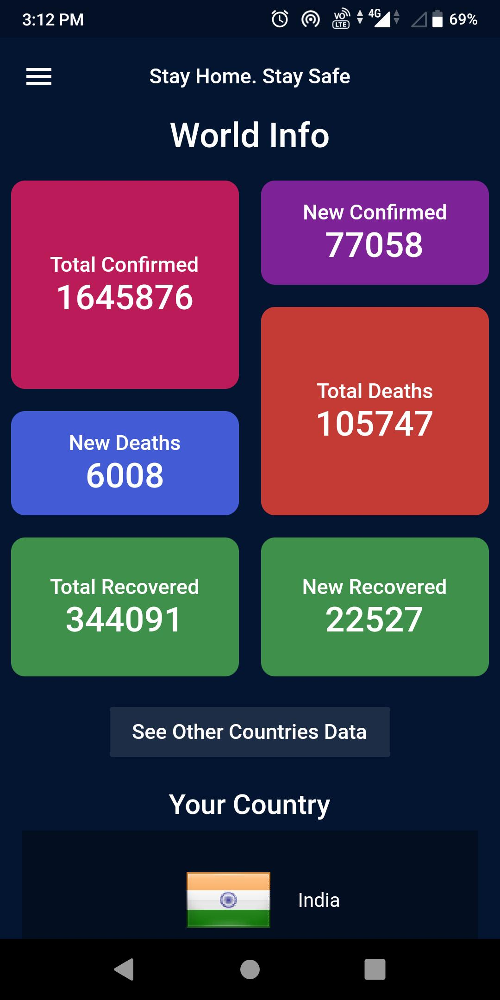
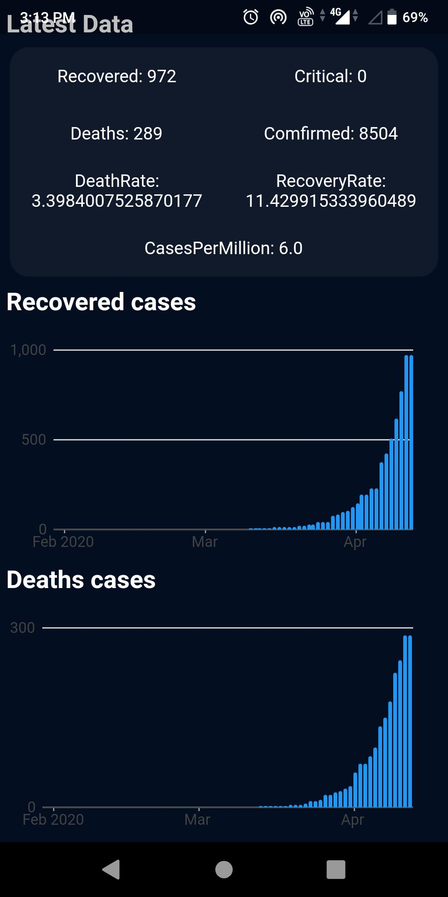
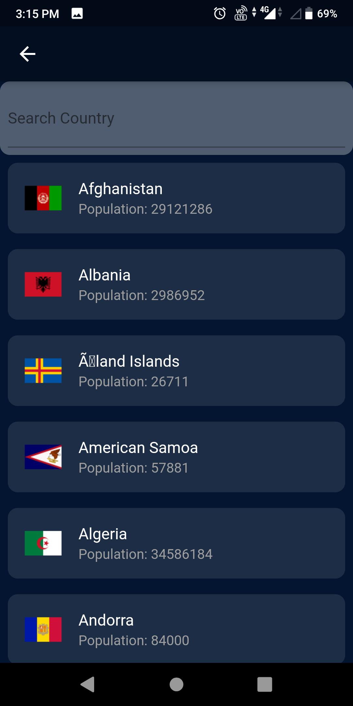
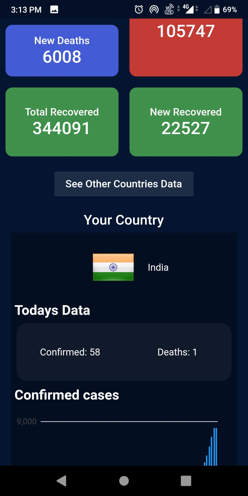
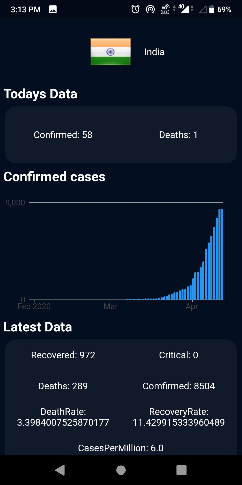

# CoronaStat
An android application for giving data about corona virus cases all over the world and country wise.

### Note that, some apis may not be working because of less covid numbers. In that case, the app might not load. 

Hello everyone!👋 During this coronavirus pandemic, I've been building a #Flutter app and web app which shows current number of cases and much more data of the world as well as many countries. Also, you can see the graphical representation of data for each country.

Hope you'll find it helpful :)

Android App Link:👉 [https://bit.ly/3cfU9jt](https://bit.ly/3cfU9jt)
(Stable, fast)
Website Link:👉 [Webiste](https://skohan.github.io/CoronaStat/website/#/)

